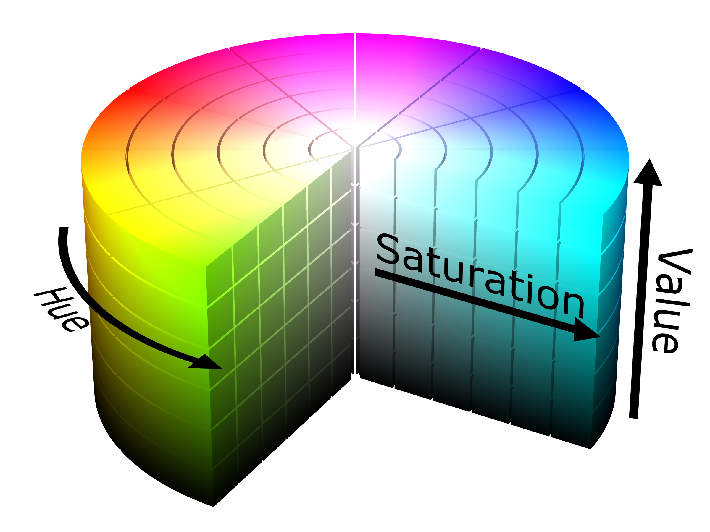
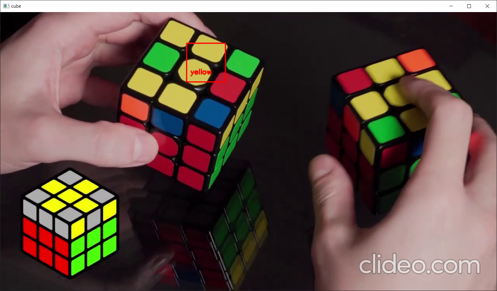
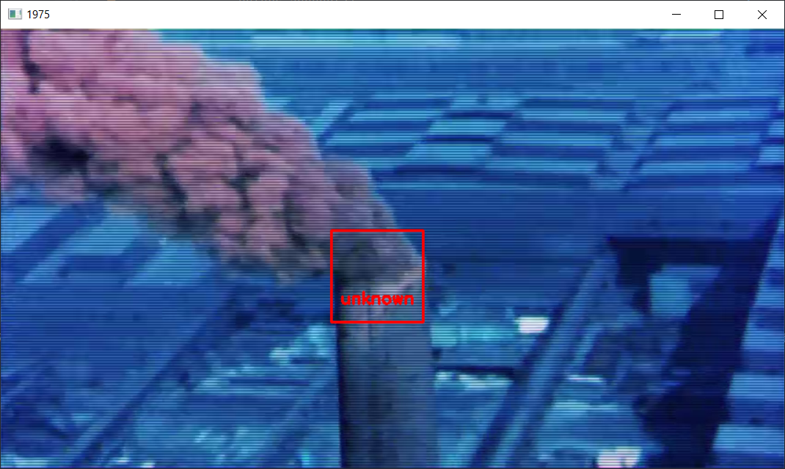

# Лабораторная 1: Определение цвета

## Задание

1. Реализовать программу согласно варианту задания. Базовый алгоритм,
используемый в программе, необходимо реализовать в 3 вариантах: с
использованием встроенных функций какой-либо библиотеки (OpenCV,
PIL и др.) и нативно на Python + |с использованием Numba или C++|.
2. Сравнить быстродействие реализованных вариантов.
3. Сделать отчёт в виде readme на GitHub, там же должен быть выложен
исходный код

**_Вариант 1_**: Определение цвета внутри области кадра. На вход поступает видео, в
определенной области отрисовывается рамка, в которой должен
определяться один из 3 цветов (можно выбрать любые). Рамку можно
передвигать с помощью стрелок на клавиатуре. Базовый алгоритм -
определение цвета внутри рамки (1, 2, 3 или никакой из известных).

## Теоретическая база

Задача определения цвета на заданном изображении заключается в проверке вхождения набора цветовых координат пикселя в диапазон координат задаваемого цвета (задаются нижняя и верхняя граница оттенка).

Цветовое пространство — это модель представления цвета, основанная на использовании цветовых координат. Цветовое пространство строится таким образом, чтобы любой цвет был представлен точкой, имеющей определённые координаты. 

Как правило, в процессе реализации программы для определения цвета используется именно цветовое пространство HSV (_Hue_, _Saturation_, _Value_ - тон, насыщенность, значение). Если рассматривать эту цветовую модель как цилиндр, то оттенок здесь изменяется при движении вдоль окружности цилиндра, насыщенность - вдоль радиуса, яркость - вдоль высоты.  

По большей части, такой выбор обоснован простотой задания цветовых интервалов в сравнении с BGR и более высокой точностью при сравнении оттенков.

## Описание работы системы

Всего было реализовано 3 подхода к написанию кода основного алгоритма:
1. С использованием OpenCV
2. С использованием NumPy
3. NumPy + Numba

Структура файлов проекта:
- _data_ - видеофайлы для тестирования программы
- _const.py_ - заданные постоянные (границы оттенков, координаты рамки, сдвиг рамки)
- _main.py_ - программный код
- _result_ - скриншоты результатов

Пошаговая реализация программы: 
1. Чтение видео из файла
2. Считывание кадра
3. Преобразование цветовой модели внутри рамки с заданными параметрами из BGR в HSV 
4. Определение цвета в соответствии с подходом 
5. Вывод результата

### Определение цвета с помощью OpenCV

Функция cv2.inRange(), принимающая на вход само изображение, нижний порог и верхний порог определённого цвета, определяет все значения, лежащие в пределах диапазона, равными 255, остальные - в 0.
Суммы значений для каждой маски записываем в отдельный массив, чтобы впоследствии определить цвет, преобладающий в исходном изображении. 

```angular2html
def detectColor(hsv_frame):
    mask_green = cv2.inRange(hsv_frame, const.lower_green, const.upper_green)
    mask_purple = cv2.inRange(hsv_frame, const.lower_purple, const.upper_purple)
    mask_yellow = cv2.inRange(hsv_frame, const.lower_yellow, const.upper_yellow)
    sums = [np.sum(mask_green), np.sum(mask_purple), np.sum(mask_yellow)]
    return matchColor(sums)
```

### Определение цвета с помощью NumPy

В данном случае нам необходимо пройтись по каждому пикселю изображения и определить, относится ли он к какому-либо из диапазонов. 
После этого (при условии, что был определён цвет хотя бы одного пикселя) с помощью np.bincount считаем количество пикселей, отнесённых к каждому из цветов, и передаём этот массив в функцию matchColors, которая используется в программе для определения индекса с максимальным значением и возвращения строки с цветом, отнесённым к этому индексу.
```angular2html
def detectColorNp(hsv_frame):
    height, width, channels = hsv_frame.shape
    colors = []
    for w in range(0, width):
        for h in range(0, height):
            px = hsv_frame[h, w]
            if (const.lower_green < px).all() and (const.upper_green > px).all():
                colors.append(0)
            elif (const.lower_purple < px).all() and (const.upper_purple > px).all():
                colors.append(1)
            elif (const.lower_yellow < px).all() and (const.upper_yellow > px).all():
                colors.append(2)
    if len(colors) == 0:
        return matchColor(np.array(colors))
    else:
        counts = np.bincount(np.array(colors))
        return matchColor(counts)
```

### Ускорение работы с помощью Numba

Numba - это библиотека Python, которая предназначена для ускорения кода с помощью компиляции кода Python в машинный код на лету.

```angular2html
from numba import njit
```

Чтобы ускорить функцию, перед её применением необходимо вписать декоратор @njit (или @jit(nopython=True) в полной форме).
```angular2html
@njit
def matchColor(counts):
    ix = np.argmax(counts) if len(counts) > 0 else -1
    if counts[ix] > 0:
        match ix:
            case 0:
                return 'green'
            case 1:
                return 'purple'
            case 2:
                return 'yellow'
    return 'unknown'
```

### Результаты работы и тестирования системы

В целом, программа верно определяет цвет внутри рамки при его наличии. Однако существуют некоторые недочёты, связанные с изначально не самым точным заданием диапазона цветовых координат.
Ниже представлены скриншоты, демонстрирующие работу программы.






Для тестирования были взяты 3 видеофайла с различной продолжительностью и разрешением. Результаты представлены в таблице.

| Название файла                    | 1975    | cube     | jaba    |
|-----------------------------------|---------|----------|---------|
| Продолжительность (сек)           | 265     | 280      | 104     |
| Разрешение                        | 854х480 | 1280х720 | 638х360 |
| Время обработки OpenCV (сек)      | 152.59  | 110.47   | 63.11   |
| Время обработки NumPy (сек)       | 676.04  | 684.33   | 287.81  |
| Время обработки NumPy+Numba (сек) | 203.07  | 126.22   | 74.45   |

### Выводы по работе

В результате выполнения лабораторной работы были изучены методы OpenCV для работы с видеопотоком, а также рассмотрены различные варианты реализации алгоритма определения цвета, преобладающего внутри кадра. 
Как видно из результатов тестирования, лучше всего с поставленной задачей справились методы библиотеки OpenCV. 
Гораздо хуже себя показал код с использованием только NumPy массивов: время обработки вырастает почти в пять раз по сравнению с OpenCV. 
Впрочем, ситуация значительно улучшается при использовании Numba.

### Использованные источники

1. https://docs.opencv.org/4.x/
2. https://numba.pydata.org/
3. https://numpy.org/doc/